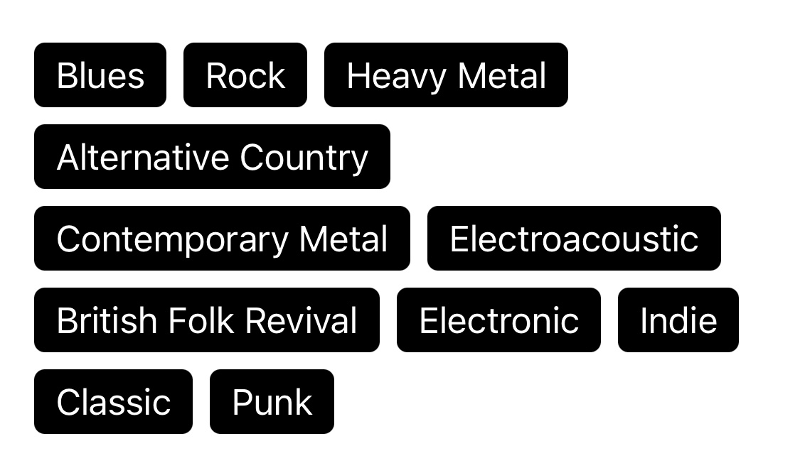

# Tagly
Tagly allows displaying lists in a tag cloud manner. It is focused and entirely written in SwiftUI, which means the API resembles the API of primitive views, such as list and stacks.

# Usage
You only need to provide a collection of identifiable elements, a closure to build each tag and, optionally, the spacing between the tags:

```swift
TagCloudView(data: tags, spacing: 8) { tag in
    Text(tag.title)
        .foregroundColor(Color.white)
        .padding(.horizontal, 10)
        .padding(.vertical, 5)
        .background(Color.black)
        .cornerRadius(5)
}
```
And you got this beautiful tag cloud:



# Requirements
iOS >= 13.0

# License
Tagly is available under the MIT license. See the LICENSE file for more info.
